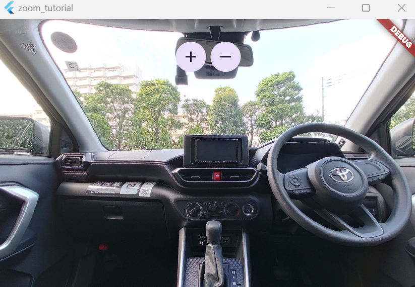
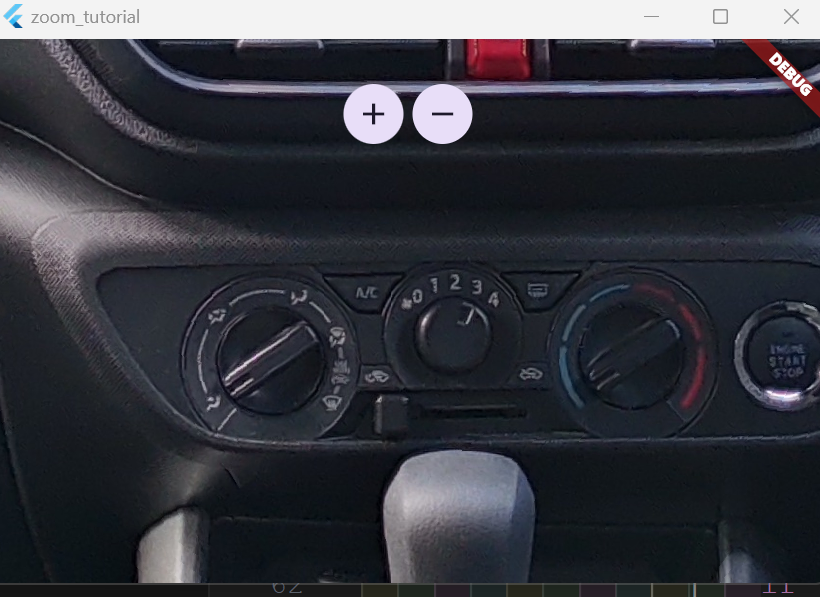
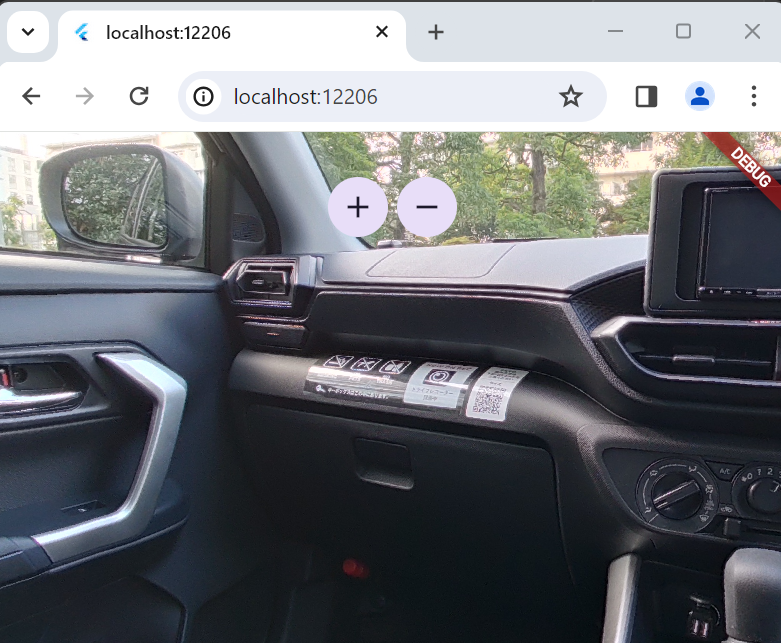

# 360 Image Zoom Tutorial for Flutter Desktop and Web

Code for tutorial to zoom 360 image using panorama_viewer package.

Works on desktop and web.

The mobile builds have pinch-to-zoom.  You don't need this
technique for mobile.
